## Project Overview

I built this lab to get hands-on experience with the kind of work an IAM analyst does in Microsoft Entra ID. Instead of only creating a few users and groups, I wanted the environment to feel more like a small company with different departments, different access needs, a separate privileged admin account, MFA, role-based access control, and Joiner-Mover-Leaver lifecycle tasks.

I used NBA player names as test identities so the accounts would be easy to recognize while I worked through the lab. The goal was not to copy a production environment exactly, but to practice the same decisions an IAM analyst has to make: who should have access, what access they should receive, what should be removed when their job changes, and how to shut down access when someone leaves.

---

## What I Built

The lab includes:

- Multiple cloud users across Finance, IT, Human Resources, Sales, and Operations
- Department-based security groups
- Role-specific entitlement groups
- A separate privileged administrator account
- Microsoft Entra **User Administrator** role assignment
- Microsoft Authenticator MFA registration
- Delegated password-reset testing
- A permissions test showing the admin account could not assign Global Administrator
- A complete Joiner-Mover-Leaver lifecycle scenario
- Session revocation and access removal during offboarding

---

## Environment

- **Platform:** Microsoft Entra ID
- **License:** Microsoft Entra ID Free
- **Identity type:** Cloud-only lab users
- **Administration:** Microsoft Entra admin center
- **MFA method:** Microsoft Authenticator
- **Privileged role tested:** User Administrator

---

# 1. Environment Overview

Before getting into the individual IAM tasks, I wanted to show the overall environment I built. By the end of the lab, the tenant contained **13 users** and **11 security groups**.

The user list includes the original department users, the separate privileged admin account, and Jimmy Butler, who was added later during the Joiner scenario.

### All Users - Part 1

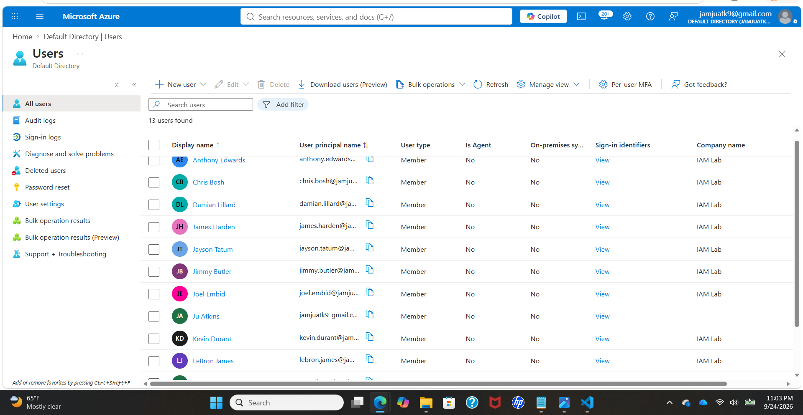

### All Users - Part 2

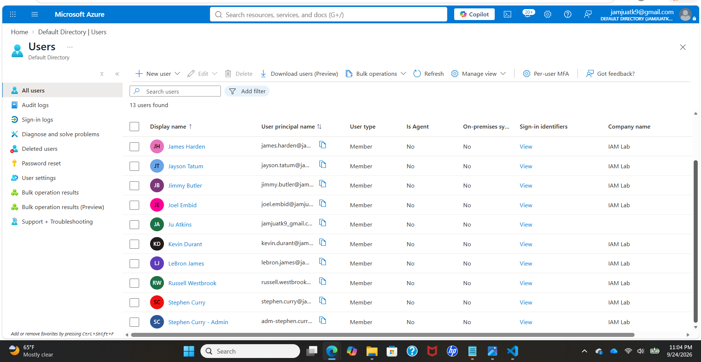

The group list shows both the department-level groups and the more specific entitlement groups I created for job-based access.

### All Groups - Part 1

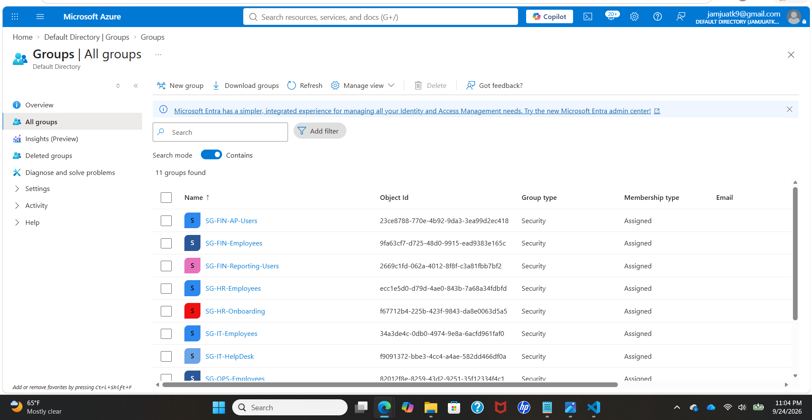

### All Groups - Part 2

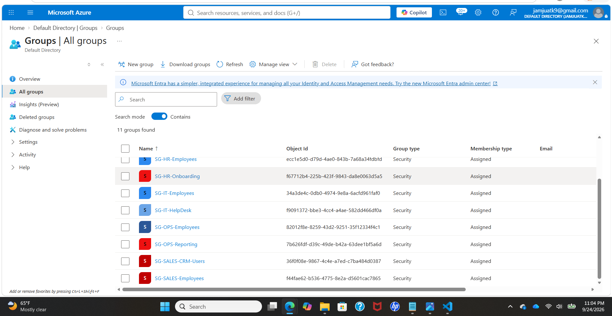

This gives a better picture of the lab as a whole before breaking down the individual provisioning, RBAC, and lifecycle tasks.

---

# 2. Building the User and Group Structure

I started by creating users for five departments:

| Department | Users |
|---|---|
| Finance | LeBron James, Kevin Durant |
| IT | Stephen Curry, Damian Lillard |
| Human Resources | Jayson Tatum, James Harden |
| Sales | Anthony Edwards, Russell Westbrook |
| Operations | Joel Embiid, Chris Bosh |

Each user was given realistic identity attributes such as:

- First and last name
- Job title
- Company name
- Department
- Employee ID
- Employee type

I used **IAM Lab** as the company name.

## Department Security Groups

Instead of naming the groups something generic like "Finance Group," I used a consistent naming convention:

`SG-<DEPARTMENT>-<PURPOSE>`

The department groups were:

- `SG-FIN-Employees`
- `SG-IT-Employees`
- `SG-HR-Employees`
- `SG-SALES-Employees`
- `SG-OPS-Employees`

These groups represent a user's basic department membership.

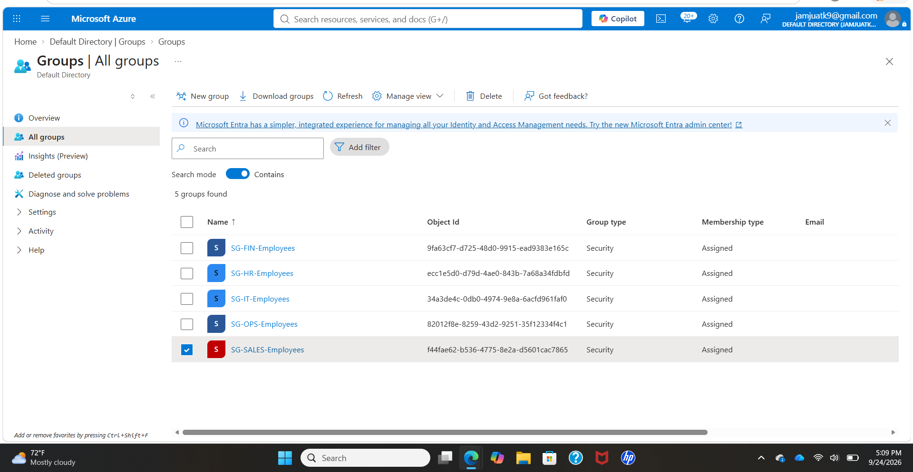

---

# 3. Separating Department Membership from Access Entitlements

One thing I wanted to practice was the difference between **where someone works** and **what systems or resources they should be able to access**.

For example, LeBron James and Kevin Durant are both Finance users, so both belong to:

`SG-FIN-Employees`

But their job functions are different, so I created different entitlement groups.

### Kevin Durant
- Department: Finance
- Job: Accounts Payable Specialist
- Baseline group: `SG-FIN-Employees`
- Entitlement group: `SG-FIN-AP-Users`

### LeBron James
- Department: Finance
- Job: Senior Financial Analyst
- Baseline group: `SG-FIN-Employees`
- Entitlement group: `SG-FIN-Reporting-Users`

This let me practice **least privilege**. Two employees can work in the same department without automatically receiving the same access.

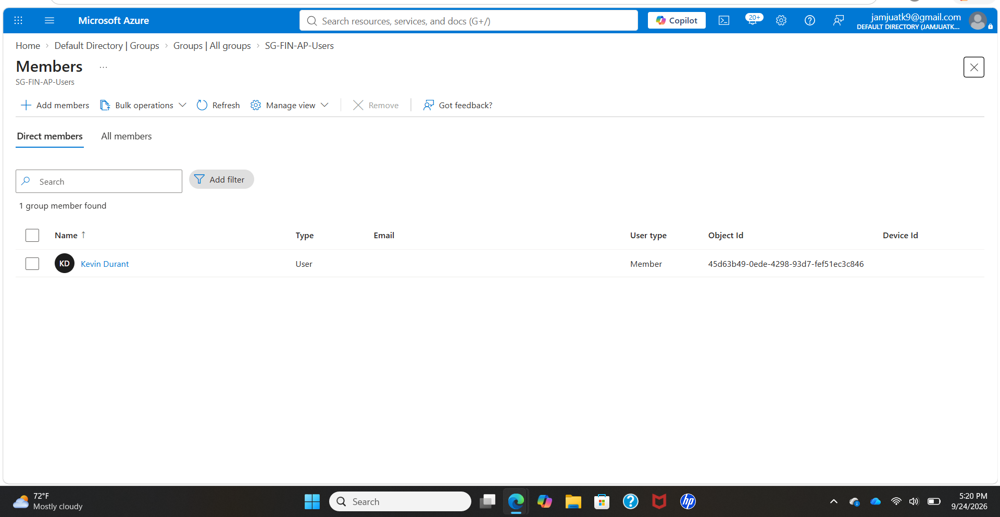

I used the same idea in the other departments:

| User | Role | Entitlement Group |
|---|---|---|
| Stephen Curry | Help Desk Analyst | `SG-IT-HelpDesk` |
| James Harden | HR Coordinator | `SG-HR-Onboarding` |
| Russell Westbrook | Account Executive | `SG-SALES-CRM-Users` |
| Joel Embiid | Operations Analyst | `SG-OPS-Reporting` |

---

# 4. Privileged Admin Account and Least Privilege

I did not want to use the normal Stephen Curry account for privileged administration. I created a separate admin identity:

- **Display name:** Stephen Curry - Admin
- **Username pattern:** `adm-stephen.curry`
- **Department:** IT
- **Employee type:** Privileged Admin
- **Role:** User Administrator

This gave me a separate privileged identity instead of mixing daily-use access with administrative access.

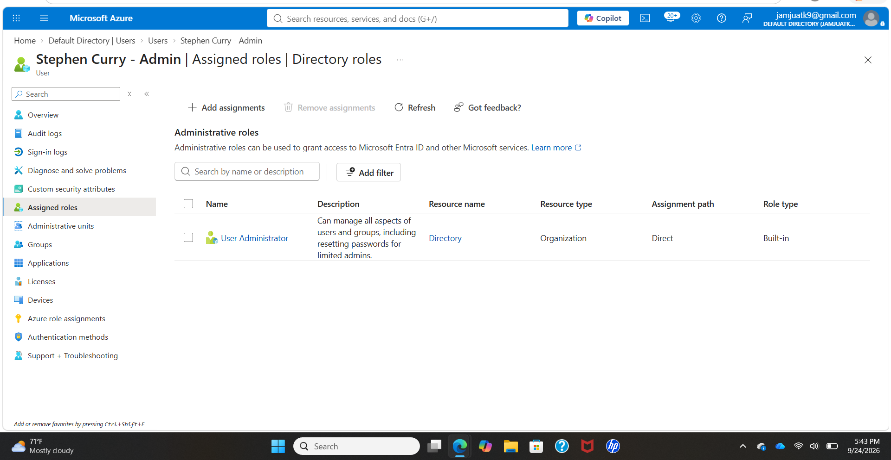

The account was assigned **User Administrator**, not Global Administrator. The goal was to practice giving an admin enough access to perform identity-management tasks without giving unrestricted control over the tenant.

---

# 5. MFA Registration

I signed into the privileged account for the first time in an InPrivate browser session.

During first sign-in:

1. The temporary password had to be changed.
2. Microsoft required additional security setup.
3. Microsoft Authenticator was registered.
4. Number matching was used to verify the registration.

After setup, Authenticator became the default sign-in method for the privileged account.

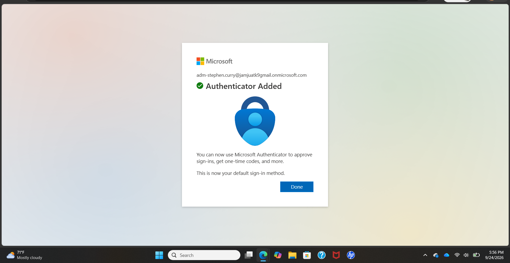

I then confirmed the privileged account could successfully enter the Microsoft Entra admin center.

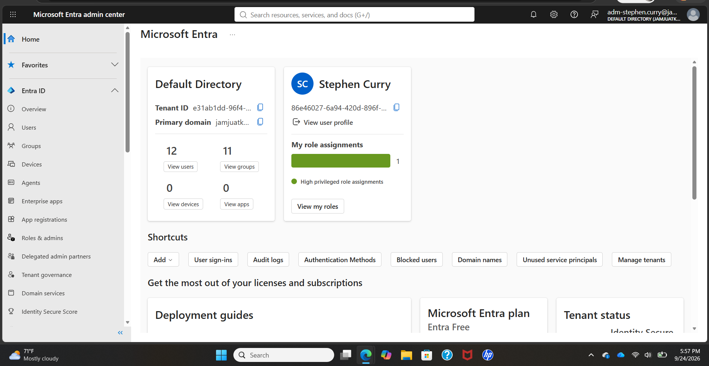

---

# 6. Testing Role-Based Access Control

Assigning a role is only part of the job. I also wanted to verify what the role could actually do.

## Allowed Action: Resetting a Normal User Password

Using the Stephen Curry admin account, I opened Kevin Durant's account and successfully performed a password reset.

This confirmed that the **User Administrator** role was actually working for delegated identity administration.

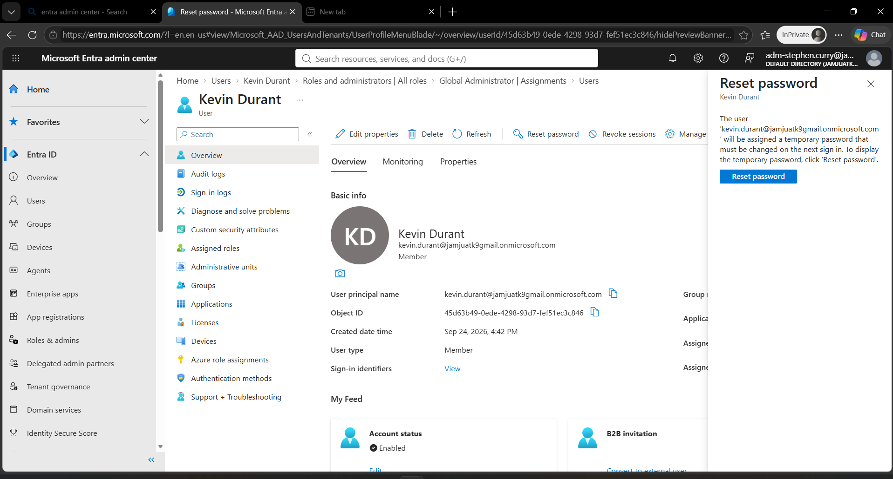

I did not include the temporary password in the repository because temporary credentials should not be published.

## Restricted Action: Global Administrator Assignment

Next, I opened the **Global Administrator** role while still signed in as the User Administrator account.

The account could view the role, but **Add assignments** was unavailable.

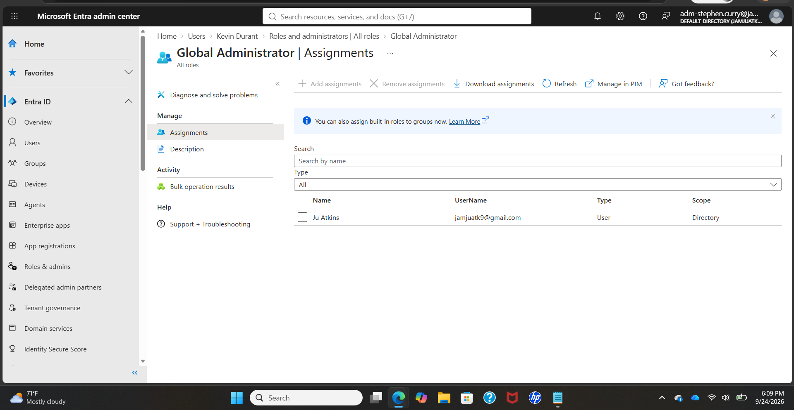 

### Why this matters in IAM

This part of the lab helped me understand why privileged access should be separated from a normal user account. I used a dedicated admin identity and assigned the User Administrator role instead of Global Administrator so the account only had the permissions needed for user-management tasks. Testing the role also showed me that least privilege should be verified, not just assumed.

---

# 7. Joiner-Mover-Leaver Lifecycle

After building the base environment, I practiced the identity lifecycle.

## Joiner Scenario

For the Joiner scenario, I created **Jimmy Butler** as a new employee.

### Identity Details
- Department: Human Resources
- Job title: Recruiter
- Employee ID: `HR003`
- Employee type: Full Time

I created the account first without assigning groups during creation. After the identity existed, I provisioned the correct access separately.

Jimmy was added to:

- `SG-HR-Employees`
- `SG-HR-Onboarding`

This simulated onboarding a new employee and granting both baseline department access and role-specific access.

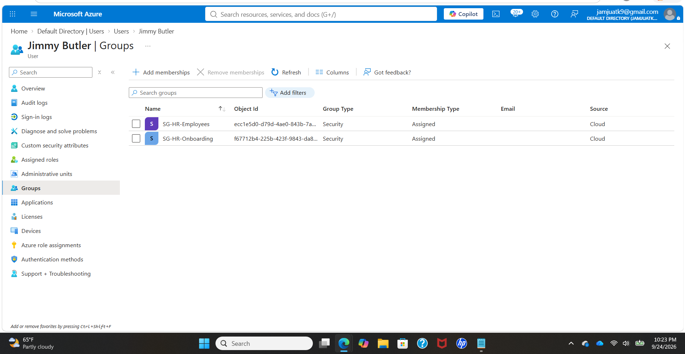 

### Why this matters in IAM

The joiner process is where access starts, so getting it right matters from day one. I gave Jimmy the baseline HR group and the onboarding entitlement that matched his role instead of adding unrelated access. That helped me practice provisioning access based on job responsibilities rather than giving a new user more permissions than they needed.

---

## Mover Scenario

For the Mover scenario, I transferred **Anthony Edwards** from Sales to Operations.

I wanted this part of the lab to show the full process rather than simply changing one group.

### Before the Move

Anthony started as:

- Job title: Sales Representative
- Department: Sales
- Employee ID: `SAL001`
- Group membership: `SG-SALES-Employees`

His original group membership is shown below.

His original job information also showed Sales as his department.

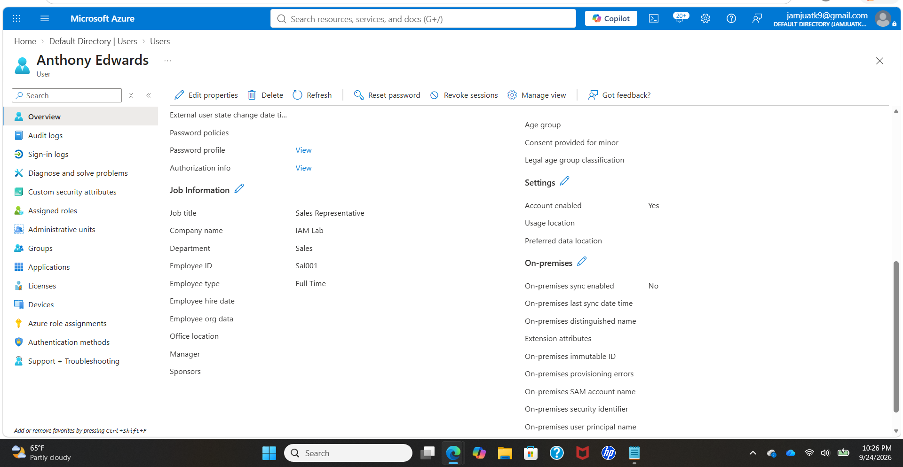

### Identity Changes

I kept Anthony's existing identity instead of creating a new user account.

I updated:

- **Job title:** Operations Specialist
- **Department:** Operations

I kept the employee ID because the employee was changing roles, not becoming a new person.

The updated identity attributes are shown below.

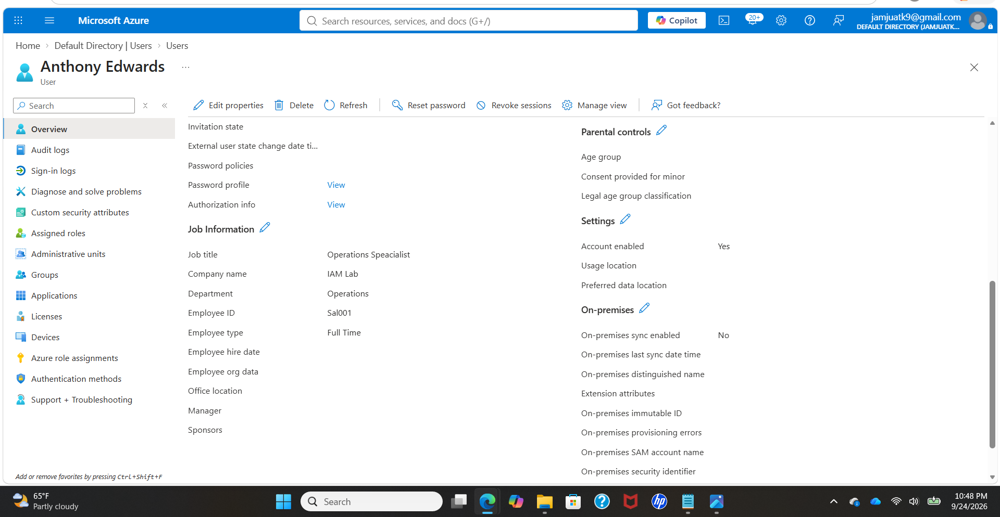

### Access Changes

After changing the identity attributes, I removed the old department access:

`SG-SALES-Employees`

Then I added the new baseline Operations group:

`SG-OPS-Employees`

I intentionally did **not** add `SG-OPS-Reporting` automatically. Anthony's new role was Operations Specialist, so I did not assume he needed the same reporting entitlement as the Operations Analyst.

That was one of the main least-privilege lessons from the mover scenario: a department change should not automatically grant every access package available in the new department.

### Why this matters in IAM

This mover scenario shows why IAM teams need to update both identity information and access when an employee changes roles. If I had only added Anthony to the Operations group and left his Sales access in place, he could have kept permissions that were no longer needed. Removing the old access first and only granting the baseline Operations access helped maintain least privilege and prevent access creep.

---

## Leaver Scenario

For the Leaver scenario, I offboarded **Chris Bosh**.

I did not immediately delete the account. Instead, I followed an access-removal process first.

### Before Offboarding

Before starting the leaver process, Chris Bosh still had Operations access through `SG-OPS-Employees`.

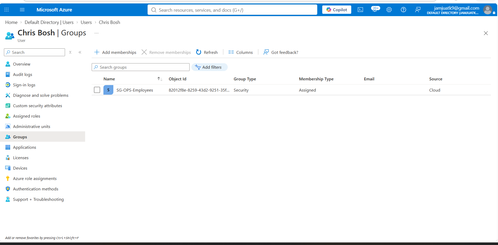

### Step 1: Disable the Account

I changed Chris Bosh's account status from Enabled to Disabled.

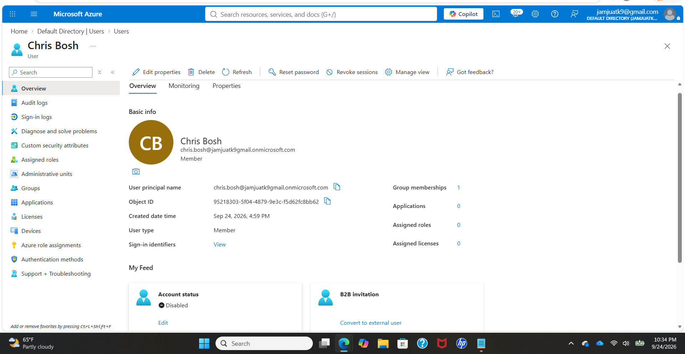

### Step 2: Revoke Existing Sessions

After disabling the account, I revoked his active sessions so any existing session would be forced to authenticate again.

Because the account was disabled, a new authentication attempt should no longer be allowed.

### Step 3: Remove Group Memberships

Chris was removed from his remaining Operations security group.

The final group view showed:

**Not a member of any groups**

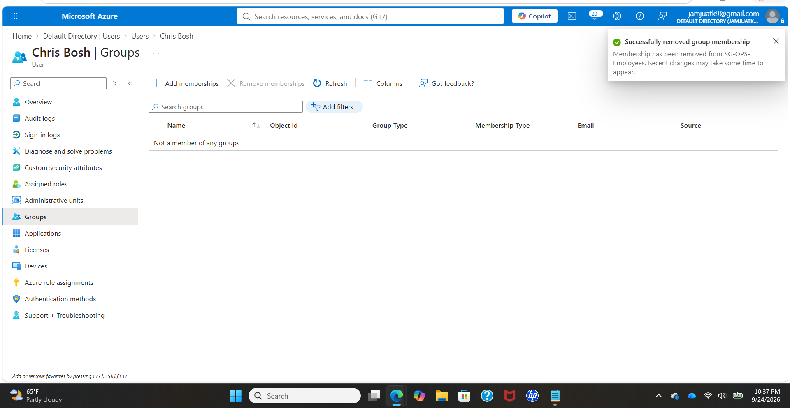

### Why Chris Bosh Still Appears Under Users

Chris Bosh is intentionally still present in the directory.

For this lab, I treated offboarding as:

- Disable the identity
- Revoke sessions
- Remove access
- Retain the disabled identity

That represents an environment where an organization may keep the account for a period of time for audit, retention, legal, investigation, or recovery reasons before final deletion.

A future extension of this lab could include deleting the account after a defined retention period and validating it under **Deleted users**.

### Why this matters in IAM

Offboarding is more than disabling an account. I also revoked active sessions and removed group memberships so the user would not keep access through an existing session or leftover permissions. Keeping the disabled account in the directory also showed how an organization could retain the identity for audit or retention purposes before final deletion.

---

# What I Learned

The biggest thing I took away from this lab is that IAM is not just creating users.

The real work is managing access throughout the user's lifecycle.

Creating the department groups was useful, but the role-specific groups made the environment much more realistic because users in the same department did not automatically receive the same permissions.

The Mover scenario also showed why access removal matters just as much as access assignment. If I had only added Anthony to the Operations group and left his Sales membership in place, he would have accumulated access that was no longer related to his job.

The privileged-admin section helped me understand the difference between a normal employee account and an administrative identity. Giving the admin account the User Administrator role instead of Global Administrator also gave me a practical example of least privilege.

Finally, the Leaver workflow reinforced that offboarding is not just deleting an account. Disabling the identity, revoking sessions, and removing group memberships are all separate actions that help make sure access is actually terminated.

---

# Skills Practiced

This project gave me hands-on practice with:

- Microsoft Entra ID
- IAM user administration
- User provisioning and deprovisioning
- Security groups
- Group membership management
- Role-based access control
- Least privilege
- Privileged account separation
- Microsoft Authenticator MFA
- Password reset administration
- Session revocation
- Joiner-Mover-Leaver lifecycle management
- Identity attribute changes
- Access entitlement management
- Access validation
- Offboarding
- IAM documentation

---

# Possible Next Steps

I can continue expanding this environment with:

- Enterprise application assignment
- SSO configuration
- Additional administrative roles
- Authentication-method policies
- Conditional Access if licensing allows it
- Dynamic groups if licensing allows it
- Access reviews / governance features
- Guest-user lifecycle scenarios
- License assignment
- More detailed sign-in and audit-log analysis
- Final account deletion after a simulated retention period

---

## Notes

This is a personal training environment. The user identities are fictional lab accounts created for practice. Screenshots are included to show the steps and results of the project.
